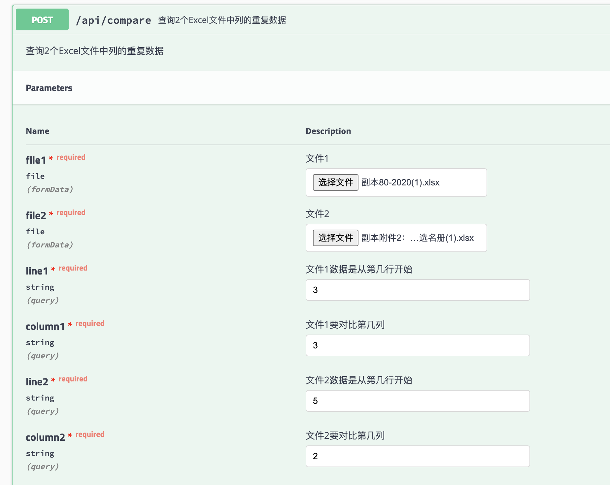

## 💡 简介

[Galang](https://github.com/gakkiyomi/compare-execl-column) 是一款go编写的excel文件列对比工具。

## 功能
可以选择两个exel文件的某列进行对比，筛选出重复的数据，并返回重复的数据文件 。

## 启动
   ~~~shell
   go get ./...

   go build

   nohup ./compare-excel-column -> error.log 2>&1 &
   ~~~

## 使用
 ~~~
 http://127.0.0.1:8085/api/compare-excel-column/swagger/index.html
 ~~~
 